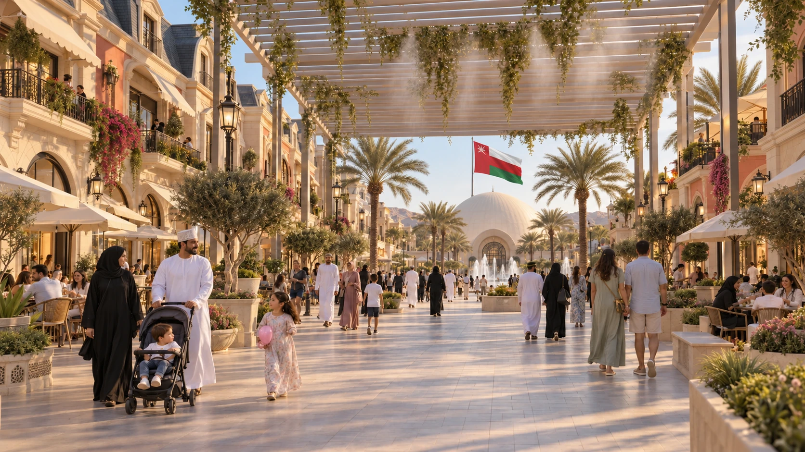

# Muscat Amusement Park (MAP)



An Arabic-first, bilingual concept website for a proposed family destination in Seeb, Muscat. The programme brings together rides, a water park, an indoor family centre and City Walk, with phased development and family public spaces.

This repository contains the editable website, a portable Blender concept scene and selected concept illustrations. The land proposal is subject to official boundaries, rights, site investigations, feasibility, funding and approvals. Visuals express a proposed experience, not existing construction or an engineered development plan.

## Run locally

Use Node.js 24 (the tested version is in `.nvmrc`). No credentials or environment file are required.

```sh
npm ci
npm run dev
```

Open `http://127.0.0.1:3108/muscat-amusement-park/`.

## Build and preview the static export

```sh
npm run build
npm run typecheck
npm run check:export
npm run preview
```

The static export is written to `out/`. The preview server binds only to `127.0.0.1:3108` and serves the configured `/muscat-amusement-park/` base path. Use `PORT=...` in your shell or `npm run preview -- 3110` for another port. Stop it with Ctrl+C.

## Project contents

- `src/`: React/Next.js presentation, public bilingual copy and styles.
- `public/`: runtime images, fonts, geographic context and the browser GLB model.
- `design/v5/muscat-park-v5.blend`: current editable Blender concept with packed resources, flags and perimeter palms.
- `design/v5/boomerang.blend`: actual supplied WFC-20A source geometry and reversible web LOD.
- `design/v3/masterplan-v3.svg`: retained vector plan; its parcel and zone footprints remain preserved in the v5 model.
- `public/references/index.html`: 25 real photographic references in nine zone groups, with source and rights information.
- `design/muscat-park.blend`: preserved previous revision.
- `design/visuals/`: selected full-resolution generated concept illustrations.
- `docs/assets-provenance.md` and `docs/v5-visual-provenance.md`: source and rights notes; third-party licence files are in `public/licenses/`.
- `.github/workflows/build.yml`: installs the lockfile, builds and uploads the static output as an Actions artifact.

## Public preview and deployment

Public website: [Muscat Amusement Park (MAP)](https://rdsolod-ui.github.io/muscat-amusement-park/). The owner authorized GitHub Pages on 2 October 2026. Push/PR CI still produces a build artifact only. To update the public preview, manually run the **Publish GitHub Pages** workflow on `codex/muscat-concept`; it rebuilds, type-checks and validates the static export before deploying that artifact. `revision.json` records the published commit and workflow ID. No custom domain or VPS is configured by this workflow. The owner separately authorized the VPS release on 2 October 2026; its publication is manual and is not part of GitHub Actions.

The website has passed local production-build and browser checks. Arabic editorial review, official site verification and venue testing remain separate. See [validation](docs/validation.md).

## Asset rights

Public visibility does not create a blanket licence for project designs or third-party assets. Preserve the individual licence and attribution notices. The concept material must not be represented as an official municipal endorsement. See [asset provenance](docs/assets-provenance.md).

## Presentation and source

The twelve chapters preserve the Salalah reference and add the requested Boomerang chapter: Earth/vision → Muscat/Seeb → masterplan → 90 m wheel → Boomerang → City Walk → character → water park → family dome → family comfort → city value → land and investment proposal. Arabic is primary and right-aligned; English is immediately below.

Three.js / React Three Fiber render the Earth, real Muscat terrain and an on-demand model viewer. GSAP controls chapter transitions and the satellite zoning → Blender render → generated vision sequence. Next.js builds a static export; presentation animation requires no application backend or account credentials. Motion pause, system reduced-motion preferences and `?graphics=off` are supported.

Open `design/v5/muscat-park-v5.blend` in Blender to edit the current metre-scale concept with packed materials and retained camera registration. The browser uses `public/models/muscat-park-v5.glb` (12.59 MB) and a separate `public/models/boomerang-v5.glb` (5.13 MB). Both contain their texture dependencies. Editable source, dimensions, animation contracts and native/export checks are documented in [the v5 model handoff](design/v5/README.md). The model is conceptual, not a construction or manufacturing deliverable.

## Revision 3

The updated programme includes a 90 m wheel, Boomerang looping coaster, family rides and arcades; a wave pool, slides and beach lounge; two-storey City Walk buildings with shaded cafe verandas; a hemispherical laser-tag and performance venue; and slatted pergolas with seasonal mist along the modelled main pedestrian network. The roundabout approach, entrance and 1,000-space parking target are retained. The expanded programme has no approved CAPEX estimate.

Eight generated chapter illustrations have distinct files and hashes; none is reused across chapters. Documentary photographs are a separate source-linked catalogue, not depictions of the Muscat project. See [model and plan](design/v3/README.md), [photo research](docs/reference-research/README.md), [visual manifest](design/visuals/v3/visual-manifest.json) and [TV typography](docs/TV-PRESENTATION.md).

The Present layout targets an 80-inch 4K display at 6 m. The 3840 × 2160 layout was measured in the browser and the 1280 × 720 composition visually inspected. Actual room readability remains to be verified.


## Revision 4

The first two chapters retain the Salalah Earth-to-city composition, now with a 16-second geography journey and a gentler 7.2-second globe approach. Masterplan and landmark chapters are swapped. Each masterplan view holds for five seconds with 1.6-second crossfades. Five zone selectors reveal independent pins and photorealistic closeups.

The first masterplan frame uses an attributed Google Maps satellite screenshot, visually registered to the supplied diagram. The existing northeastern intersection connects to the proposed internal roundabout and parking in all three views. Read [site evidence](docs/v4-site/README.md). This does not establish cadastral boundaries or approved road access.

The detailed Blender model contains the supplied WFC-20A geometry, a 90 m concept observation wheel, entrance, two-storey cafe promenade and hemisphere venue. The 3D control plays 15-second illustrative construction followed by wheel rotation and a gentle orbit. The separate landmark animation assembles the wheel against a generated Muscat park-and-mountain background. [Model validation](design/v4/validation) and [motion contract](docs/v4-motion.md).

No CAPEX, engineering, ride safety or civil access approval is implied. The 50 m wheel source filename does not set the concept height: the owner explicitly retained 90 m.


## Revision 5

The presentation now has twelve chapters, including a separate actual-source Boomerang viewer, native Blender render and the supplied portrait video in a phone frame. The model and image composition remain enlarged and softly faded into the left side; Arabic copy stays on the right. The native 90 m wheel assembly transitions to a generated finished-park view.

The editable park adds a large moving Oman flag above the hemisphere, Oman/Russia flags at the entrance and 122 additional perimeter palms. Parcel boundaries, parking geometry, source road connection and aerial pins remain unchanged from v4. The latest parking image incorporates the owner’s corrected vehicle direction and landscaping.

The final chapter presents MG Group’s project-supplied experience and a proposed ASAAS / Vision 2040 investment discussion. Its Salalah day/sunset/night loop uses generated lighting interpretations of a supplied real drone photograph; these are not three independent documentary shoots. Native/source media, generated edits and actual photography remain distinguished in [v5 visual provenance](docs/v5-visual-provenance.md) and [research notes](docs/v5-research.md).

New runtime illustrations are WebP and video is WebM. `npm run check:export` requires the v5 models, all three Salalah images and twelve Arabic headings, verifies embedded dependencies and animation names, and checks media signatures. Browser interaction and in-room legibility are separate acceptance checks. Historical revision notes above describe their respective releases.
