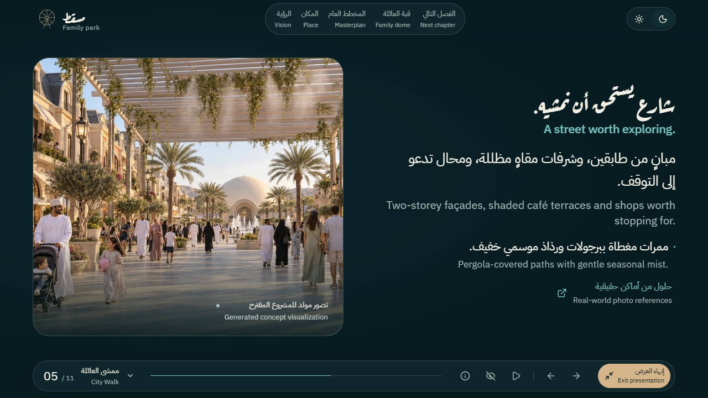

# Muscat Amusement & Water Park



An Arabic-first, bilingual concept website for a proposed family destination in Seeb, Muscat. The programme brings together rides, a water park, an indoor family centre and City Walk, with phased development and family public spaces.

This repository contains the editable website, a portable Blender concept scene and selected concept illustrations. The land proposal is subject to official boundaries, rights, site investigations, feasibility, funding and approvals. Visuals express a proposed experience, not existing construction or an engineered development plan.

## Run locally

Use Node.js 24 (the tested version is in `.nvmrc`). No credentials or environment file are required.

```sh
npm ci
npm run dev
```

Open `http://127.0.0.1:3108/muscat-amusement-park/`.

## Build and preview the static export

```sh
npm run build
npm run typecheck
npm run check:export
npm run preview
```

The static export is written to `out/`. The preview server binds only to `127.0.0.1:3108` and serves the configured `/muscat-amusement-park/` base path. Use `PORT=...` in your shell or `npm run preview -- 3110` for another port. Stop it with Ctrl+C.

## Project contents

- `src/`: React/Next.js presentation, public bilingual copy and styles.
- `public/`: runtime images, fonts, geographic context and the browser GLB model.
- `design/v3/muscat-park-v3.blend`: current editable Blender concept with packed resources.
- `design/v3/masterplan-v3.svg`: updated plan derived from the model.
- `public/references/index.html`: 25 real photographic references in nine zone groups, with source and rights information.
- `design/muscat-park.blend`: preserved previous revision.
- `design/visuals/`: selected full-resolution generated concept illustrations.
- `docs/assets-provenance.md`: source and rights notes; third-party licence files are in `public/licenses/`.
- `.github/workflows/build.yml`: installs the lockfile, builds and uploads the static output as an Actions artifact.

## Publication and deployment are separate

Publishing this source repository on GitHub does not deploy the website. CI has read-only repository permissions and produces a downloadable artifact; it does not configure GitHub Pages, upload to a VPS or activate a public website. A future VPS release requires a separate command from the project owner.

The website has passed local production-build and browser checks. Arabic editorial review, official site verification and venue testing remain separate. See [validation](docs/validation.md).

## Asset rights

Public visibility does not create a blanket licence for project designs or third-party assets. Preserve the individual licence and attribution notices. The concept material must not be represented as an official municipal endorsement. See [asset provenance](docs/assets-provenance.md).

## Presentation and source

The eleven chapters follow the Salalah reference: Earth → Muscat/Seeb → proposed attractions → masterplan → City Walk → character → water park → indoor centre → family comfort → city value → phases and land decision. Arabic is primary and right-aligned; English is immediately below.

Three.js / React Three Fiber render the Earth, real Muscat terrain and an on-demand model viewer. GSAP controls chapter transitions and the updated model-derived masterplan → Blender render → generated vision sequence. Next.js builds a static export; presentation animation requires no application backend or account credentials. Motion pause, system reduced-motion preferences and `?graphics=off` are supported.

Open `design/v3/muscat-park-v3.blend` in Blender to edit the current concept (metres, 16 cameras, packed materials, no external satellite texture). The 7.62 MB `public/models/muscat-park-v3.glb` is the current browser presentation export. The model is conceptual, not a construction or manufacturing deliverable.

## Revision 3

The updated programme includes a 90 m wheel, large concept coaster, family rides and arcades; a wave pool, slides and beach lounge; two-storey City Walk buildings with shaded cafe verandas; a hemispherical laser-tag and performance venue; and slatted pergolas with seasonal mist along the modelled main pedestrian network. The roundabout approach, entrance and 1,000-space parking target are retained. The expanded programme has no approved CAPEX estimate.

Eight generated chapter illustrations have distinct files and hashes; none is reused across chapters. Documentary photographs are a separate source-linked catalogue, not depictions of the Muscat project. See [model and plan](design/v3/README.md), [photo research](docs/reference-research/README.md), [visual manifest](design/visuals/v3/visual-manifest.json) and [TV typography](docs/TV-PRESENTATION.md).

The Present layout targets an 80-inch 4K display at 6 m. The 3840 × 2160 layout was measured in the browser and the 1280 × 720 composition visually inspected. Actual room readability remains to be verified.
